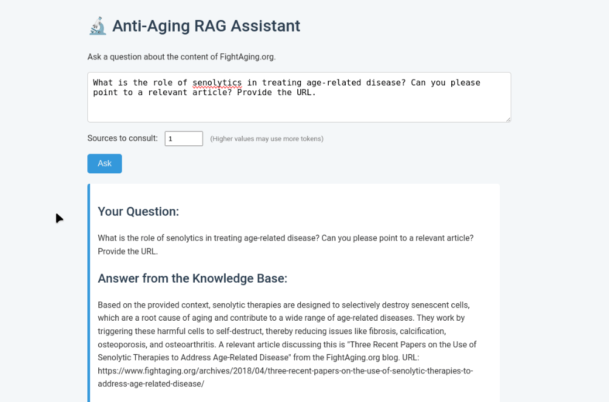

# Analysis of FightAging.org Content (2004-2025)

## Introduction

As someone passionate about entering the anti-aging research field and honing my machine learning skills, I created this project to pursue both goals simultaneously.

Please bear in mind that I am currently no expert in this field; I created this project mainly to orient myself, but I still believe it is worth sharing. Therefore, is worth noting that the analysis may contain imprecisions or areas for improvement.

I chose to analyze the rich content from FightAging.org, one of my favorite resources on the subject, made available under the Creative Commons Attribution 4.0 license.

While I'm still developing my expertise, I hope this data-driven exploration of longevity topics proves interesting and useful. The analysis is presented in four parts, starting with a foundational topic review using traditional text analysis methods.

The original content can be found at https://www.fightaging.org/.

## Results of each experiment

1. [Manual Topic Analysis](https://github.com/CesarPuentes/FightAgingLiteratureAnalysis/blob/master/Data_Analysis/4.Results_Analysis/1.%20Manual_Topic_Analysis.md)
2. [NER Analysis](https://github.com/CesarPuentes/FightAgingLiteratureAnalysis/blob/master/Data_Analysis/4.Results_Analysis/2.%20NER_Analysis.md)
3. [BERT Topic Analysis](https://github.com/CesarPuentes/FightAgingLiteratureAnalysis/blob/master/Data_Analysis/4.Results_Analysis/3.%20BERT_Topic_Analysis.md)

# Demonstration of a simple RAG Application

# Conclusion

---
# Analysis of Longevity Research Topics (2004-2025)

## 1. Evolution of Research Focus

The focus of longevity research has transitioned from a foundational, advocacy-driven phase centered on the SENS (Strategies for Engineered Negligible Senescence) framework to a translational phase focused on clinical applications and commercialization.

* **Foundational Phase (circa 2004-2011):** The initial period was characterized by establishing the SENS framework, which classifies aging damage into core categories. Research focused on advocacy and developing proof-of-concept approaches for these damage types, such as breaking molecular cross-links (glucosepane), clearing metabolic waste (amyloid), and addressing mitochondrial mutations.

* **Translational Phase (circa 2012-Present):** A significant shift occurred, driven by successful preclinical results. The focus moved to translating foundational concepts into viable therapies, marked by increased startup activity, venture funding, and a push towards human clinical trials. This phase is dominated by the success of senolytics and growing interest in emerging fields like epigenetic reprogramming.

---
## 2. Centrality of Cellular Senescence

Cellular senescence became a primary research target due to evidence demonstrating that senescent cells are not merely dormant but are causative agents of age-related pathology.

* **Mechanism of Harm (SASP):** The key discovery was the Senescence-Associated Secretory Phenotype (SASP). Senescent cells secrete a pro-inflammatory cocktail of cytokines, chemokines, and enzymes that degrade surrounding tissue, drive chronic inflammation, and promote aging.

* **Therapeutic Rationale:** Preclinical studies, beginning around 2011, showed that selectively destroying senescent cells in mice could reverse multiple age-related conditions and extend healthspan. This established senescence as a direct cause of aging, shifting the therapeutic goal from preventing the formation of these cells to actively clearing them—a strategy known as **senolysis**.

---
## 3. Promising Therapeutic Strategies

The most advanced therapeutic strategies are those progressing towards human clinical trials, with senolytics being the clear leader.

* **Senolytic Therapies:** This is the most mature area of SENS-inspired research. The objective is to induce apoptosis in senescent cells.
    * **Modalities:** Approaches include small molecule drugs (e.g., Dasatinib + Quercetin), immunotherapies, and gene therapies.
    * **Clinical Progress:** Multiple companies are in or approaching clinical trials for conditions like osteoarthritis, demonstrating the viability of this strategy.

* **Other Maturing Therapies:** Several other SENS categories are nearing clinical translation:
    * **Cross-Link Breakers:** Development of molecules to break glucosepane cross-links, which cause tissue stiffening.
    * **Amyloid and Aggregate Clearance:** Therapies using catalytic antibodies and enzymes to clear harmful protein aggregates, such as transthyretin amyloid in the heart and A2E in the retina.
    * **Mitochondrial Restoration:** Gene therapies to restore mitochondrial function are in clinical development for specific inherited diseases, providing a pathway for broader anti-aging applications.

---
## 4. Key Concepts for Further Study

For individuals entering the field, a structured learning path is recommended.

* **Foundational Framework:** Begin with the **"Hallmarks of Aging"** (López-Otín et al., 2013 & 2023). This provides the essential biological context for the mechanisms of aging, including:
    * Cellular Senescence
    * Mitochondrial Dysfunction
    * Stem Cell Exhaustion
    * Epigenetic Alterations
    * Telomere Attrition
    * Altered Nutrient Sensing
    * Genomic Instability

* **Key Molecular Pathways:** Focus on the specific targets where therapies are being developed:
    * **mTOR Pathway:** A central nutrient sensor involved in metabolism.
    * **NAD+ Metabolism:** A critical metabolic coenzyme that declines with age.
    * **The SASP:** The inflammatory secretions of senescent cells.

* **Emerging Frontiers:** Explore newer, complex areas:
    * **The Gut Microbiome:** Its role in systemic health and inflammation.
    * **Cellular Reprogramming:** The use of Yamanaka factors to partially reverse cellular age.

The data indicates that a deep understanding of cellular senescence is currently the most impactful area, but this knowledge should be built upon a solid foundation of the broader hallmarks of aging. Several key compounds investigated for their senolytic properties include **Dasatinib**, **Quercetin**, and **Fisetin**.

---